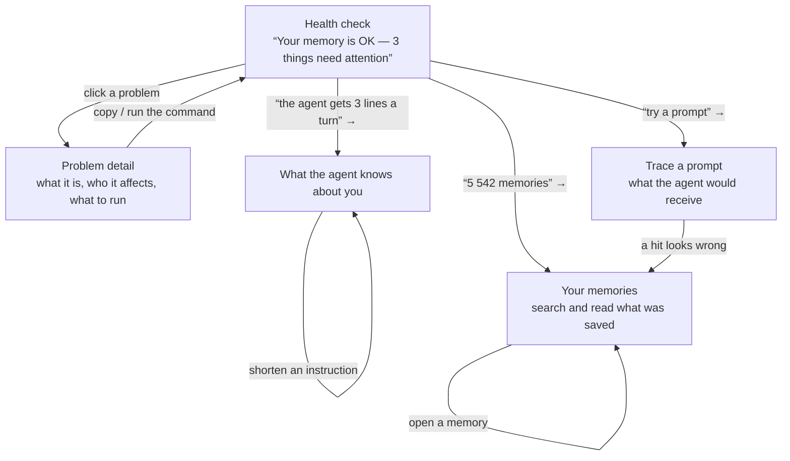

# Screens — memory health

Surface: **desktop**, served at `localhost` by `tmem view`. Floors: body ≥ 14px, target ≥ 32px.
Every figure on every screen is measured from the live store, snapshot `s1-b41d81cf395452e7`,
2026-08-03. Numbers marked *(example)* are invented; everything else is real.

## Flow

The target action lives on **Health check**: run the fix for the top problem. Every other screen
has a path back to it — the problem list is in the sidebar on all five.

## Assumed domain

`docs/domain/` does not exist in this repo. **The source of truth for every concept below is
`scripts/view/contract.js`**, whose typedefs carry the definitions and the reasons. The
vocabulary mapping — implementation term → the word a person reads — is in `design-brief.md`
§ Vocabulary, and every UI word here traces to a row in that table. No concept is invented.

---

## Health check

The home screen and the whole product's answer. It replaces the audited `Health` strip plus the
`Does the agent actually know me?` block.

- **Primary action**: run the fix for the top problem — `tmem sync` (a copy-command button, since
  the surface is read-only and cannot execute; see the ADR in the brief).
- **Empty state**: a store with no memories yet — "Nothing saved yet. Your assistant will start
  remembering after your first conversation in a project. Nothing to fix." plus the one command
  that creates a store, `/memory-init`. An invitation, not a shrug.
- **Loading state**: the verdict line, the three problem rows and the counts render as skeleton
  bars at their final heights, so nothing moves when the snapshot lands. The store count and the
  root path are known before the read and render immediately.
- **Error states**: (1) `store_unreadable` — one or more stores could not be opened. Copy: "3 of
  51 projects could not be opened. Their memories are not counted anywhere on this page. →
  Show which ones". Way forward: the list, and the OS-level reason verbatim from
  `Source.reason`. (2) The whole read failed — "tmem view could not read
  `/home/dev/.memory-tencentdb`. The folder is missing or not readable." → `Try again`, and the
  path so the person can check it themselves.
- **Variants**: all clear
- **API bindings**: `GET /api/snapshot` → `Snapshot.totals`, `Snapshot.gaps`,
  `Snapshot.persona.projection`, `Snapshot.health`; `GET /api/events` (SSE) for the change badge.

Copy notes:

- The verdict sentence is the signature element and the only ≥30px text on the page. It is a
  full sentence with a verb, never a number alone: **"Your memory is working — 3 things need
  attention."**
- Every problem row is `<what is wrong, in a sentence with the number inside it>` /
  `<why, one line>` / `<the command>`. The number never appears without the sentence.
- The counts strip carries totals **and their gap in the same tile** — "5 542 memories saved ·
  the agent sees about 3 of them per turn" — never a total on its own. This is the third
  non-negotiable constraint and it is a layout rule, not a copy rule: the gap figure is inside
  the same bordered tile, at the same size, not a footnote.
- **"Not checked yet" is a separate row from "zero".** 23 projects have an empty index (measured,
  a real zero, fixable by `tmem sync`); 24 projects have no index file at all (unmeasured,
  excluded from every percentage). They are two different rows with two different verbs and two
  different marks — a solid dot for the measured problem, the 45° hatch swatch for the unchecked
  one. Collapsing them reintroduces the bug this tool was built to catch (`contract.js:20–33`).

## Problem detail

Opened from a row on Health check. One problem, its evidence, and the way out.

- **Primary action**: copy the command that fixes this problem.
- **Empty state**: n/a — this screen only exists when a gap opened it.
- **Loading state**: n/a — the gap and its evidence arrive in the same snapshot as the row that
  opened it; there is no second fetch.
- **Error states**: n/a — the payload is already in hand. A store that could not be read never
  produces this screen; it produces the Health check error state instead.
- **Variants**: not checked yet
- **API bindings**: `GET /api/snapshot` → `Snapshot.gaps[]` (`Gap.evidence`, `Gap.suggestion`).

Copy notes:

- The heading is the finding in the person's words; `Gap.title` (the engineer's words) sits
  underneath in the "what the tool measured" block, verbatim, so a bug report can quote it.
- `Gap.evidence` always includes a denominator (`contract.js:812`). The UI renders it as a
  sentence — "1 125 of 2 826 memories in orchard-api" — never as a bare numerator.
- The **not checked yet** variant has no command that "fixes" it, because there is nothing known
  to be broken. Its action is `tmem sync` too, but framed as "build an index here so this can be
  measured", and the page says in as many words: *this is not a score of zero.*

## What the agent knows about you

The rewritten persona view. Answers "which of my standing instructions actually reach the
assistant, and which are just sitting in a file".

- **Primary action**: shorten one instruction that never reaches the assistant.
- **Empty state**: no persona has been built yet — "Your assistant has not built a picture of you
  yet. It does that after enough conversations, or when you run `/memory-consolidate`."
- **Loading state**: n/a — rendered from the same snapshot as Health check; the section list is
  present before the bullets expand.
- **Error states**: n/a — `persona_missing` is a gap, so an absent persona is the empty state
  above, not an error. A persona file that cannot be parsed surfaces on Health check.
- **API bindings**: `GET /api/snapshot` → `Snapshot.persona`; `GET /api/persona` for the source
  text behind "show the original".

Copy notes:

- Sections are grouped by **what happens to them**, not by duty class: "Reaches the assistant
  every session" / "Only if the assistant goes looking" / "Never reaches it". Those are
  `INJECTION_TIERS` in the person's words (`sessionStart` / `onDemand` / `never`).
- Every instruction is shown as a **one-line summary at 96 characters with a "show all" control**
  — the audited page printed 81 bullets at up to 1 434 chars each and became unreadable. Finding
  F6 in the audit.
- The duty chip stays a **dashed** outline, carried over from the audited surface, because it is
  a guess the tool made and the person can correct it. The dashed border is doing real work: it
  says "this is a claim". Keep it.

## Your memories

**The screen the audit found missing.** 5 542 memories and 219 topic summaries exist and appear
nowhere in the built UI.

- **Primary action**: search your memories.
- **Empty state**: two of them, and they are different. (1) No memories at all in this project —
  "Nothing saved for lantern yet." (2) A search that matched nothing — "No memory
  matches 'kubernetes'. This project can only match exact words — its semantic index is empty.
  → `tmem sync`", which is the same finding as Health check's top problem, arriving where the
  person actually feels it.
- **Loading state**: the result rows render as skeletons at row height; the project filter and
  the count strip stay put.
- **Error states**: n/a — a store that cannot be read is reported by Health check, which owns the
  `store_unreadable` error; this screen is not reachable for such a store (its row is disabled
  there with the reason).
- **API bindings**: `GET /api/store/:slug/records?q=&type=&hasVector=` → `RecordsPage`;
  `PAGE.DEFAULT_LIMIT = 100`.

Copy notes:

- Clutter is shown, marked, and **counted in the total** — 2 165 of the 5 542 are things the
  assistant saved by mistake. Hiding them would make the total a lie. The filter is
  "Hide clutter (2 165)", off by default.
- `RecordRow.hasVector` is `boolean|null`, and `null` means the vector reading did not happen
  (`contract.js:1161`). The row badge is therefore three-valued: "findable by meaning" /
  "exact words only" / "not checked". Never a checkbox.
- Row metadata in the person's words: "saved in the background" (`writePath: auto`) vs "saved on
  purpose" (`awaited`).

## Trace a prompt

The audited page's best idea, moved from last to a first-class screen: type what you would say
and see exactly what the assistant would be handed.

- **Primary action**: see what the assistant would receive for this prompt.
- **Empty state**: before any search — the field, three real example prompts from this store as
  clickable chips, and one sentence: "Type anything you would say to the assistant. This runs the
  same lookup it runs, and shows you the result."
- **Loading state**: the result panel keeps its height and shows "Running the same lookup the
  assistant runs…"; the query stays in the field.
- **Error states**: (1) the recall path threw — "The lookup failed: <reason from the envelope>.
  Your memories are not affected." → `Try again`. (2) `vectorStatus: "unmeasured"` — not an
  error but must be said: "This ran on exact words only. lantern has no semantic index,
  so a memory that means the same thing in different words was not found. → `tmem sync`".
- **API bindings**: `GET /api/recall?q=&slug=&limit=` → `RecallResponse` (`hits[]`, `injected`,
  `injectedChars`, `vectorStatus`).

Copy notes:

- The screen's punchline is `RecallResponse.injected` — the literal block the assistant receives.
  It is shown as-is, in mono, labelled "This is what your assistant is handed", with its
  character count. No paraphrase: this is the one place where the raw system string is the point.
- Hits that did **not** survive the budget are shown below the line with the reason, because "why
  didn't it remember X" is the question that brings people here.
- `RecallHit.matchedBy` in the person's words: "exact words" (`fts`) / "meaning" (`vector`) /
  "both".

---

## Error catalog coverage

`docs/api/` does not exist, so there is no RFC 9457 problem-type list to diff against. **Recorded
as a gap.** The error states above were derived instead from the rejection paths the contract
does declare — `API_ERROR` (`not_found`, `bad_request`, `store_unreadable`, `internal`) and the
three-way `Status` (`ok` / `unmeasured` / `error`) — and every one of the four `API_ERROR` codes
has a user-vocabulary sentence:

| `API_ERROR` code | Where it surfaces | The sentence |
|---|---|---|
| `store_unreadable` | Health check, error state 1 | "3 of 51 projects could not be opened. Their memories are not counted anywhere on this page." |
| `not_found` | Your memories | "That project is not in your memory folder any more." |
| `bad_request` | Trace a prompt | "That search could not be run — the project filter no longer exists. → Search all projects" |
| `internal` | Health check, error state 2 / Trace a prompt, error state 1 | "The lookup failed: <reason>. Your memories are not affected." |
